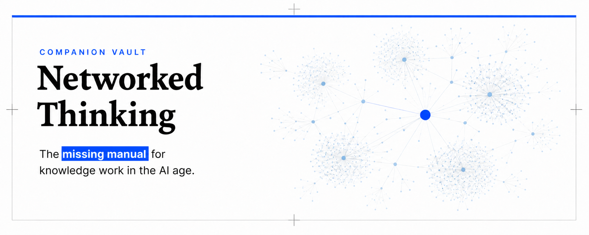

# Networked Thinking

[](LICENSE.md)
[](https://github.com/jrgilbertson/networked-thinking/releases)



Networked Thinking is a book and practical system for turning saved articles, highlights, and notes into usable context for writing, decisions, and work. This vault is the system's working implementation to accompany the book.

## Purpose

I built the original setup in 2022 after realizing I confused saving information with learning from it. AI has made that mistake easier to make. The system protects the useful friction of writing down what I know, what connects, and what I still need to figure out. Then when I bring in AI, I'm asking it to work with my thinking instead of replacing it.

This vault is the working implementation. Every note type, template, and folder described in the forthcoming book "Networked Thinking" by Jason Gilbertson and Terri Yeh is built out and linked, so you can see the system running rather than read about it in the abstract. Curate what earns a place using the 5W framework. Connect ideas through links and structure notes instead of folder hierarchies. Cultivate the system through regular review so it gets more useful with use.

This is one way to run the methodology, not the only way. Adapt it to how you already think.

## Quickstart

Install [Obsidian](https://obsidian.md/), the free local-first app this vault is built for. Then either click "Use this template" on this repository to create your own version-controlled copy, or download the latest release ZIP from the [Releases page](https://github.com/jrgilbertson/networked-thinking/releases) for a plain folder. On Windows, extract that ZIP somewhere short such as `C:\vault` rather than the Desktop, because Windows silently skips files whose extracted path exceeds 260 characters. Open that folder as a vault in Obsidian (File → Open Vault), then read [GETTING-STARTED.md](GETTING-STARTED.md) for the full folder map, template inventory, and linking mechanics.

## Structure

Content is organized by workflow state, not topic category. Links and structure notes carry the topic organization instead of folders. The essential folders:

```text
Atomic Notes/     Single-concept notes, one idea each (YYYYMMDDHHMM filenames)
Structure Notes/  Topic maps that link related atomic notes together
Reference Notes/  Notes on external sources, kept before they're synthesized
Templates/        Starting points for every note type
Inbox/            Raw capture, sorted during weekly review
Reviews/          Daily, weekly, and quarterly reflection notes
```

People, Meetings, Projects, Vocabulary Notes, and Places and Things are optional workflow folders, added only when a real need shows up. [GETTING-STARTED.md](GETTING-STARTED.md) has the complete folder map, the full template inventory, and the wikilink/alias mechanics that hold the network together.

For agentic assistants working directly in the vault, the companion [Networked Thinking Skills](https://github.com/jrgilbertson/networked-thinking-skills) project adds `atomic-note` and `atomic-note-audit` skills (`npx skills add`). The book's paste-into-any-chat-AI prompt lives in Appendix D.

## Status

This vault is active, pre-launch material for the book, due in 2026. It already holds fourteen atomic notes, three structure notes, fourteen templates, five days of example daily notes, and one fully processed reference note, all real content to open and read rather than stub files. Two tagged releases exist so far. See [CHANGELOG.md](CHANGELOG.md) for what changed between them. Additional vocabulary entries and cross-domain linking examples are still being added.

Learn more and join the waitlist at [networkedthinking.ai](https://networkedthinking.ai/). For beta reading or early-access questions, email [jason.gilbertson@gmail.com](mailto:jason.gilbertson@gmail.com) or [yeh.terri@gmail.com](mailto:yeh.terri@gmail.com).

## License

CC BY 4.0. See [LICENSE](LICENSE.md).
